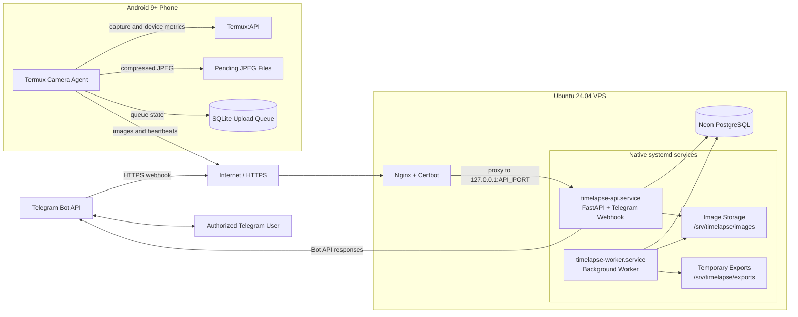
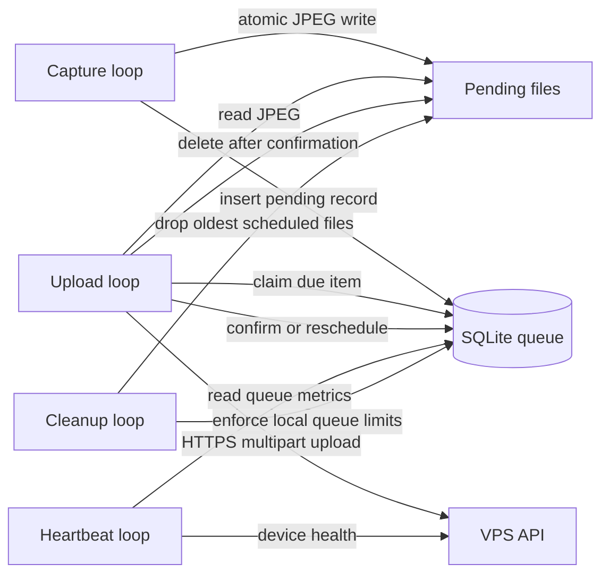
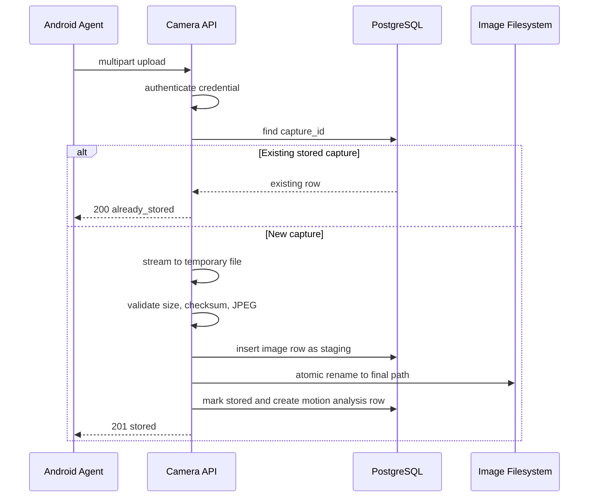
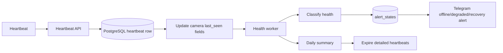
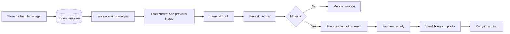
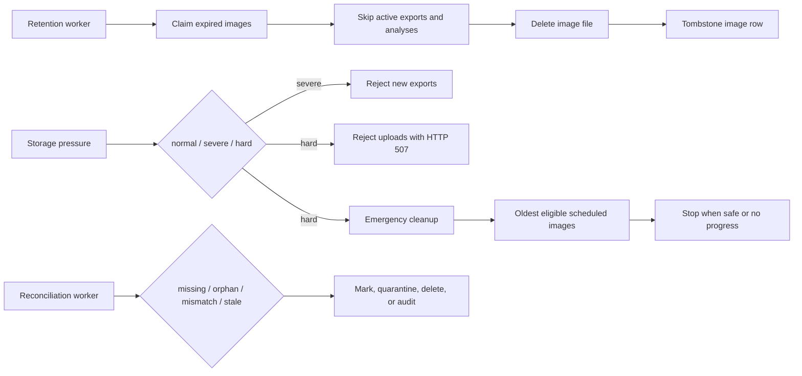

# Architecture

This document is the durable architecture summary for future contributors and agents. It replaces the need to reread the original long specification for day-to-day implementation work.

The project is an Android still-image time-lapse security camera system. An Android phone captures scheduled JPEG stills, stores them locally until upload succeeds, and reports health. A VPS ingests images and heartbeats, stores metadata in PostgreSQL and files on disk, runs worker jobs for health/motion/exports/retention/reconciliation, and exposes operations through Telegram.

## Goals and Non-Goals

### MVP goals

- Run the camera agent on Android 9+ without root using Termux, Termux:API, and Termux:Boot.
- Capture one image every 60 seconds by default.
- Resize captures to fit within 1280×720 and encode JPEG at quality 72 by default.
- Queue failed uploads locally in SQLite and retry safely.
- Upload to the VPS over HTTPS with revocable camera credentials.
- Store image metadata in PostgreSQL and image files on the VPS filesystem.
- Detect offline/degraded cameras and send deduplicated Telegram health alerts.
- Detect motion by comparing scheduled still images with the previous valid scheduled image.
- Group motion detections into five-minute events and send only the first image alert.
- Allow authorized Telegram users to inspect status, retrieve latest images, and request ZIP exports.
- Generate one MP4 per enabled camera for the previous Asia/Jakarta day, send it automatically through Telegram, and delete the generated file after delivery.
- Queue authorized Telegram voice notes for verified playback on a selected Android camera.
- Interpret Telegram date/time input in Asia/Jakarta; store and process backend timestamps as UTC.
- Retain images for seven days by default and protect active exports from retention deletion.
- Detect and repair or quarantine database/filesystem mismatches.
- Deploy production as native systemd services on Ubuntu with Nginx and Certbot, not Docker Compose.

### MVP non-goals

- Continuous video recording or live streaming.
- Facial recognition or AI object classification.
- Cloud object storage.
- A native Android application.
- Remote control of Android system settings.
- Guaranteed detection of motion that happens entirely between scheduled captures.

## Reference Baselines

Implementation decisions were checked against these primary references:

- Ubuntu 24.04 LTS release notes and lifecycle: https://documentation.ubuntu.com/release-notes/24.04/
- Termux project: https://termux.dev/en/
- Termux:API: https://github.com/termux/termux-api
- Termux:Boot: https://github.com/termux/termux-boot
- FastAPI deployment concepts: https://fastapi.tiangolo.com/deployment/
- Python Packaging `pyproject.toml` guide: https://packaging.python.org/en/latest/guides/writing-pyproject-toml/
- Ruff configuration and formatter: https://docs.astral.sh/ruff/configuration/
- python-telegram-bot documentation: https://docs.python-telegram-bot.org/en/stable/
- Telegram Bot API: https://core.telegram.org/bots/api
- PostgreSQL version support: https://www.postgresql.org/support/versioning/
- Nginx proxy module: https://nginx.org/en/docs/http/ngx_http_proxy_module.html
- Certbot user guide: https://eff-certbot.readthedocs.io/en/stable/using.html
- motionEye: https://github.com/motioneye-project/motioneye
- Frigate: https://docs.frigate.video/

The design borrows surveillance concepts from motionEye and Frigate, but deliberately avoids continuous streams, AI inference, and NVR complexity. The selected approach is a smaller custom pipeline: scheduled Android stills, server-side frame differencing, filesystem storage, PostgreSQL metadata, and Telegram operations.

## Technology Baseline

| Area | Selection |
|---|---|
| Android runtime | Android 9+, Termux, Termux:API, Termux:Boot |
| Camera agent | Python, Pillow, HTTPX, SQLite |
| Host OS | Ubuntu Server 24.04 LTS |
| Process manager | Native systemd services |
| Public TLS/reverse proxy | Host-installed Nginx and Certbot |
| Server Python | Python 3.12 in `/opt/android-remote/.venv` |
| HTTP API | FastAPI with Uvicorn bound to loopback |
| Database | Neon PostgreSQL: pooled runtime URL and direct migration URL |
| ORM/driver | SQLAlchemy asyncio with asyncpg |
| Migrations | Alembic |
| Telegram | python-telegram-bot webhook dispatch inside FastAPI |
| Image/video processing | OpenCV headless, Pillow, and system `ffmpeg` |
| Testing | Pytest and pytest-asyncio |
| Linting/formatting | Ruff |
| Packaging | Plain `pip`, `server/pyproject.toml`, `camera-agent/requirements.txt` |

Production deployment uses host-managed systemd services. Releases are copied under `/opt/android-remote/releases`, `/opt/android-remote/current` points at the active release, and `deploy-systemd.sh` installs the server package into a shared virtual environment before restarting services. No Poetry, uv, Pipenv, or PDM is required.

## Architecture Overview



The system uses a store-and-forward architecture. The Android phone is responsible for capture, compression, validation, temporary queueing, upload, and heartbeat reporting. The VPS is responsible for durable storage, metadata indexing, motion comparison, health evaluation, retention, Telegram interaction, and ZIP generation.

## Component Responsibilities

### Android camera agent

One long-running Python process runs cooperative loops for capture, upload, cleanup, heartbeat reporting, and camera command polling.



The agent should:

1. Calculate capture timing from a monotonic clock.
2. Invoke `termux-camera-photo` for the configured camera ID.
3. Validate the raw file exists, is non-empty, and decodes.
4. Apply EXIF orientation, resize, and JPEG compression.
5. `fsync` and atomically rename the prepared image into the pending directory.
6. Calculate SHA-256 and file size.
7. Insert a pending queue row in SQLite.
8. Upload independently from the capture loop so upload delays do not block future captures.
9. Delete the local file only after the server returns `stored` or `already_stored`.
10. Report dropped-image counts in heartbeats after local queue cleanup.

### FastAPI API

The API has intentionally narrow responsibilities:

- authenticate camera credentials;
- accept image uploads;
- accept heartbeats;
- expose authenticated camera command claim, media, and result endpoints;
- receive authenticated Telegram webhook updates and dispatch command handlers;
- expose liveness.

The API does **not** run motion analysis, ZIP generation, retention, Telegram delivery, or reconciliation in request handlers. Long-running and expensive work belongs in workers.

### Background worker

One worker process is enough for MVP scale. It runs independent loops for:

- health evaluation and alert deduplication;
- heartbeat daily aggregation and detailed heartbeat expiry;
- motion analysis and motion-event grouping;
- pending motion alert retry;
- export ZIP creation and Telegram delivery;
- daily time-lapse job creation, MP4 generation, Telegram delivery, and immediate MP4 cleanup;
- Telegram voice-file download and ffmpeg normalization outside webhook handlers;
- camera command expiry and immediate audio cleanup;
- retention and emergency cleanup;
- filesystem reconciliation.

PostgreSQL rows and `FOR UPDATE SKIP LOCKED` provide safe claiming. Redis or another message broker is intentionally not required for the MVP.

### Telegram bot

The bot uses python-telegram-bot asynchronous handlers initialized in the FastAPI lifespan. Telegram posts updates to `/api/v1/telegram/webhook`, protected by `X-Telegram-Bot-Api-Secret-Token`. API startup registers the webhook automatically and fails if registration fails, so systemd cannot report a healthy API without Telegram operations. Command handlers authorize, validate, and create/read jobs. They do not perform expensive ZIP or image-processing work.

Initial administrator access uses `TELEGRAM_ADMIN_USER_ID`; `TELEGRAM_ADMIN_CHAT_ID` is not used.

## Public API Contracts

### Image upload

```http
POST /api/v1/cameras/{camera_slug}/images
Authorization: Bearer cam_<token-id>_<secret>
Content-Type: multipart/form-data
```

Multipart fields:

| Field | Rules |
|---|---|
| `capture_id` | UUID-format identifier, unique per capture |
| `captured_at_utc` | RFC 3339 timestamp with UTC offset |
| `capture_source` | `scheduled`, `manual`, or `motion` |
| `sha256` | 64-character hex digest matching uploaded bytes |
| `image` | JPEG file, maximum 5 MiB |

Responses:

- `201 stored` for a new stored capture.
- `200 already_stored` for an idempotent retry.
- `401` for invalid/revoked credentials.
- `413` for images over 5 MiB.
- `422` for invalid JPEG/checksum/dimensions/timestamps.
- `507 storage_pressure_hard_limit` when VPS storage is below the hard threshold.



### Heartbeat

```http
POST /api/v1/cameras/{camera_slug}/heartbeats
Authorization: Bearer cam_<token-id>_<secret>
```

Heartbeats include agent version, uptime, battery, temperature, available phone storage, queue size/count, oldest pending item, latest capture/upload timestamps, dropped image count, consecutive capture failures, and last error code.

## Data Model Overview

PostgreSQL stores:

- `cameras`: identity, capture settings, retention settings, motion thresholds, health state, latest observed timestamps.
- `camera_credentials`: token IDs and digests for revocable camera bearer credentials.
- `images`: capture metadata, generated storage path, file size, dimensions, checksum, storage state, deletion marker.
- `motion_analyses`: per-image frame-diff work state and metrics.
- `motion_events` and `motion_event_images`: five-minute event grouping and representative alert image.
- `camera_heartbeats`: detailed heartbeat history.
- `heartbeat_daily_summaries`: daily aggregation before detailed heartbeat expiry.
- `telegram_principals`: authorized Telegram users/chats, roles, and selected voice playback camera.
- `camera_commands`: durable voice preparation/playback state, audit metadata, expiry, checksum, and retained outcome metadata.
- `alert_states`: persistent health-alert deduplication state.
- `export_jobs`, `export_job_images`, `export_parts`: export snapshot, ZIP part metadata, and delivery state.
- `timelapse_video_jobs`, `timelapse_video_job_images`, and `timelapse_video_deliveries`: deterministic daily image snapshots, leased generation state, per-recipient delivery state, and retained MP4 metadata.
- `audit_events`: security/worker/storage-repair audit trail.

Image storage state values are:

- `staging`: database row exists while a file is being finalized;
- `stored`: metadata and filesystem copy are valid;
- `deleting`: retention has claimed the row for deletion;
- `missing`: file is gone or marked missing after retention/reconciliation.

## Core Flows

### Scheduled capture and upload

```mermaid
flowchart LR
    Schedule[Schedule capture] --> Capture[Capture image]
    Capture --> Validate[Validate raw file]
    Validate --> Compress[Normalize and compress JPEG]
    Compress --> Queue[(SQLite pending queue)]
    Queue --> Claim[Claim due upload]
    Claim --> Upload[Upload over HTTPS]
    Upload --> Auth[Authenticate and validate upload]
    Auth --> Store[(PostgreSQL image row)]
    Store --> File[Install JPEG on filesystem]
    File --> Confirm[stored or already_stored]
    Confirm --> Delete[Delete local pending file]
```



1. Android schedules captures every configured interval.
2. Capture output is validated, normalized, compressed, and queued locally.
3. Upload loop claims due queue items and sends them to the VPS over HTTPS.
4. Server stores metadata and file atomically enough to survive retries.
5. Duplicate `capture_id` uploads are idempotent.
6. Android deletes local pending files only after server confirmation.

### Health and alerts



1. Android sends heartbeats every configured heartbeat interval.
2. API persists heartbeat details and updates camera `last_seen_at`, `last_capture_at`, and `last_upload_at`.
3. Worker classifies health as online, degraded, offline, or disabled.
4. Worker persists `alert_states` so unchanged conditions do not spam Telegram.
5. Recovery alerts are also deduplicated.
6. Telegram operational messages are English and user-facing timestamps are Asia/Jakarta.

### Motion detection



1. Each accepted scheduled image creates a pending motion-analysis row.
2. Worker claims pending analysis rows with database locking.
3. `frame-diff-v1` compares the current image with the previous valid scheduled image from the same camera.
4. Static scenes produce no motion; controlled movement produces motion; large brightness shifts can be suppressed.
5. Positive detections are grouped into events with a five-minute window.
6. Only the first image of a new event is sent to Telegram.

### Telegram retrieval and exports

```mermaid
flowchart LR
    Command[Telegram command] --> Authorize[Authorize Telegram user]
    Authorize --> Parse[Parse command]
    Parse --> ValidateRange[Validate range and camera]
    ValidateRange --> Jakarta[Asia/Jakarta input]
    Jakarta --> UTC[Convert to UTC range]
    UTC --> Snapshot[(Snapshot image IDs)]
    Snapshot --> Zip[Build ZIP part and manifest]
    Zip --> Document[Send Telegram document]
    Document --> Sent[Mark part sent]
    Sent --> Delete[Delete local part]
    Delete --> Complete[Complete export job]
```



1. Telegram updates arrive through the authenticated FastAPI webhook.
2. Authorization checks Telegram user ID before command handling.
3. Unauthorized users receive a generic denial and no camera details.
4. `/status [camera]` returns health and queue summaries without filesystem paths.
5. `/latest [camera]` sends the latest stored image.
6. `/images YYYY-MM-DD HH:mm YYYY-MM-DD HH:mm [camera]` parses input as Asia/Jakarta, converts to UTC, enforces `[start, end)` and a maximum 24-hour range, then snapshots selected image IDs.
7. Export worker builds ZIP parts from the snapshot and includes a CSV manifest.
8. ZIP parts target at most 45 MiB; oversized single-image parts fail with a stable error.
9. Telegram document sends are durable enough that already-sent parts are not resent after restart.
10. Sent export parts are deleted locally.

### Daily time-lapse videos

1. After 00:10 Asia/Jakarta, the worker creates one idempotent job per enabled camera for the previous local calendar day.
2. The job snapshots stored scheduled images using a half-open UTC range derived from the Asia/Jakarta day.
3. `ffmpeg` generates an H.264 MP4 from ordered snapshot frames outside request handlers.
4. The worker snapshots recipients before creating a job; without recipients, no job or retention protection is created.
5. Leased claims prevent concurrent workers from processing the same job, and stale claims remain recoverable.
6. Per-recipient delivery rows are committed after each successful send, so retries skip recipients that already received the video.
7. Delivery retries reuse an existing generated MP4. A completed job with interrupted cleanup deletes the file without resending.
8. Severe/hard storage pressure defers generation and deletes retained retry MP4s; failed/oversized artifacts are deleted while size, checksum, status, and stable error code remain in PostgreSQL.

### Telegram voice playback

1. `/speakcamera [camera]` reads or updates the authorized principal's enabled playback camera.
2. A voice-note webhook validates duration and declared size, then persists a short-lived `preparing` command; it does not download or transcode in the API request.
3. The worker downloads the Telegram file with a bounded stream, normalizes it to MP3 with `ffmpeg`, verifies metadata, and transitions the command to `pending`.
4. The selected Android camera claims the command with its existing camera credential, downloads only its command media, verifies size and SHA-256, and reports `started`.
5. The agent invokes `termux-media-player play <file>`, reports `completed` or a stable failure code, and always deletes its temporary file.
6. The server deletes audio immediately after completion, failure, or expiry while retaining command metadata. A worker expiry sweep handles cameras that never poll.

### Retention, disk protection, and reconciliation



1. Retention computes expiry from capture time and per-camera retention days.
2. Retention claims eligible rows and skips active exports, active daily video snapshots, and pending/processing motion analyses.
3. Missing files during retention are treated as successful deletion and audited.
4. Filesystem deletion errors restore rows to `stored` for retry.
5. Hard disk pressure rejects new uploads with HTTP 507.
6. Severe disk pressure rejects new exports.
7. Emergency cleanup deletes oldest eligible scheduled images first.
8. Reconciliation detects missing DB files, orphaned files, size/checksum mismatches, stale staging rows, stale temp files, and old export files.
9. Orphaned files are moved to quarantine before deletion.

## Time Policy

- Store database timestamps in UTC.
- Process worker comparisons and retention cutoffs in UTC.
- Android API payload timestamp fields use UTC names and require an offset.
- Telegram user input for `/images` is Asia/Jakarta.
- Telegram user-facing output timestamps are Asia/Jakarta.
- Do not introduce local server timezone dependencies; production sets `TZ=UTC`.

## Trust Boundaries and Security

- Android camera credentials are bearer secrets. Do not log plaintext credentials or Authorization headers.
- Camera authentication uses token ID lookup plus digest comparison with a server-side pepper.
- Telegram user data is untrusted until authorized by server-side records or `TELEGRAM_ADMIN_USER_ID` bootstrap.
- Client filenames are ignored. Server storage paths are generated from trusted camera metadata.
- Nginx is the public entry point. FastAPI and PostgreSQL are not public listeners.
- Database URLs, bot tokens, camera credentials, peppers, `.env` files, generated ZIPs, and uploaded images must not be committed.

## Failure and Recovery Model

- Phone offline: images remain in SQLite and retry with backoff.
- Server/API unavailable: queued uploads remain local until confirmed.
- Duplicate upload: server returns `already_stored` without duplicating image rows.
- Worker interruption: database job state supports reclaim/resume behavior.
- Telegram delivery failure: health/motion/export state is persisted so work can retry or be audited.
- Voice preparation failure: the command is marked failed, temporary audio is deleted, and a safe Telegram notification is attempted.
- Camera command expiry: server audio is deleted even when the Android camera is offline.
- Export interruption: restart resumes at the first truly unsent part; already-sent parts are deleted without resending.
- Retention/export race: export snapshot and retention use row locking so active or locked images are protected.
- Database/file mismatch: reconciliation marks missing rows, audits mismatches, quarantines orphans, and removes stale temp/export files.

## Deployment Model

Production scripts live in `infrastructure/`:

- `bootstrap-ubuntu.sh`: installs OS packages, creates directories, configures Nginx/UFW basics.
- `deploy-systemd.sh`: validates environment, installs the server package, runs migrations, installs systemd/Nginx units, obtains certificates, starts services.
- `verify-foundation.sh`: validates deployment foundation.
- `camera-admin.sh`: runs installed camera credential administration commands.

Systemd units:

- `timelapse-api.service` (FastAPI and Telegram webhook)
- `timelapse-worker.service`
- `timelapse-migrate.service`
- `timelapse-camera.target`

Operator procedures are documented under `docs/operator/`.
